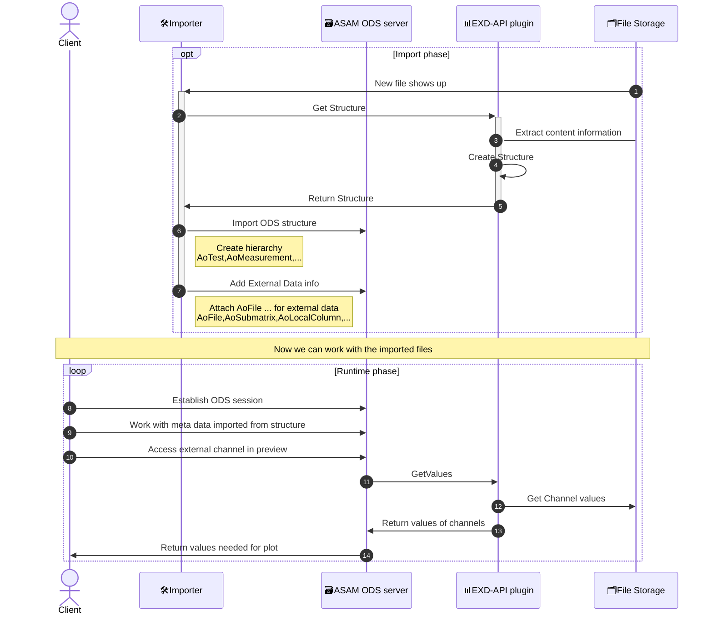

# ASAM ODS EXD-API MDF4 plugin

[](https://github.com/peak-solution/asam_ods_exd_api_mdf4/actions/workflows/docker-build.yml)
[](https://pypi.org/project/asam-ods-exd-api-mdf4/)
[](https://pypi.org/project/asam-ods-exd-api-mdf4/)
[](https://opensource.org/licenses/MIT)

This repository contains a [ASAM ODS EXD-API](https://www.asam.net/standards/detail/ods/) plugin that uses [asammdf](https://pypi.org/project/asammdf/) to read the [ASAM MDF4](https://www.asam.net/standards/detail/mdf/wiki/) files.

It is built on the [ods-exd-api-box](https://pypi.org/project/ods-exd-api-box/) helper library which provides the gRPC server infrastructure and proto stubs.

Find more tools supporting your digital transformation in the [Peak Solution Git Repo](https://github.com/peak-solution).


## Content

### Implementation
* [src/asam_ods_exd_api_mdf4/external_data_file.py](src/asam_ods_exd_api_mdf4/external_data_file.py)<br>
  Implements the `ExdFileInterface` from `ods-exd-api-box` to access MDF4 files using [asammdf](https://pypi.org/project/asammdf/).
  Also contains the entry point to run the gRPC service.

### Tests
* [test_exd_api.py](tests/test_exd_api.py)<br>
  Some basic tests on example files in `data` folder.
* [example_access_exd_api_mdf4.ipynb](example_access_exd_api_mdf4.ipynb)<br>
  jupyter notebook the shows communication done by ASAM ODS server or Importer using the EXD-API plugin.

## Development

### Setup

Install [uv](https://docs.astral.sh/uv/) and then install the project with dev dependencies:

```
uv sync --group dev
```

### Run Tests

```
uv run python -m unittest discover tests
```

### Run Plugin Locally

Use an explicit IPv4 bind address on Windows to avoid IPv6 bind issues:

```bash
uv run asam-ods-exd-api-mdf4 --bind-address 127.0.0.1 --port 50051
```

Stop the server with `Ctrl+C`. A non-zero exit code after interruption is expected.

### Run Plugin With uvx

Run the latest published package without installing it into the current project environment:

```bash
uvx asam-ods-exd-api-mdf4 --bind-address 127.0.0.1 --port 50051
```

### Code Quality

```bash
uv sync --group dev                    # 1. Install all dependencies
uv run ruff format .                   # 2. Format code
uv run ruff check --fix .              # 3. Fix lint violations
uv run mypy src/asam_ods_exd_api_mdf4/external_data_file.py      # 4. Type check
uv run python -m unittest discover tests  # 5. Run tests
```

## Docker

### Docker Image Details

The Docker image for this project is available at:

`ghcr.io/peak-solution/asam-ods-exd-api-mdf4:latest`

This image is automatically built and pushed via a GitHub Actions workflow. To pull and run the image:

```
docker pull ghcr.io/peak-solution/asam-ods-exd-api-mdf4:latest
docker run -v /path/to/local/data:/data -p 50051:50051 ghcr.io/peak-solution/asam-ods-exd-api-mdf4:latest
```

### Using the Docker Container

To build the Docker image locally:
```
docker build -t asam-ods-exd-api-mdf4 .
```

To start the Docker container:
```
docker run -v /path/to/local/data:/data -p 50051:50051 asam-ods-exd-api-mdf4
```

have a look at [start options](https://totonga.github.io/ods-exd-api-box/server-options.html) to
figure out how to customize the behavior of the EXD-API plugin.

## Architecture and Usage in ODS Server


```mermaid
sequenceDiagram

actor CLIENT as Client
participant PDTT as 🛠️Importer
participant PODS as 🗃️ASAM ODS server
participant PLUGIN as 📊EXD-API plugin
participant FILE as 🗂️File Storage

autonumber

opt Import phase
  FILE ->>+ PDTT: New file shows up
  PDTT ->>+ PLUGIN : Get Structure
  PLUGIN -> FILE: Extract content information
  PLUGIN ->> PLUGIN: Create Structure
  PLUGIN ->>- PDTT: Return Structure
  PDTT ->> PODS: Import ODS structure
  Note right of PDTT: Create hierarchy<br/>AoTest,AoMeasurement,...
  PDTT ->>- PODS: Add External Data info
  Note right of PDTT: Attach AoFile ... for external data<br/>AoFile,AoSubmatrix,AoLocalColumn,...
end

Note over CLIENT, FILE: Now we can work with the imported files

loop Runtime phase
  CLIENT ->> PODS: Establish ODS session
  CLIENT ->> PODS: Work with meta data imported from structure
  CLIENT ->> PODS: Access external channel in preview
  PODS ->> PLUGIN: GetValues
  PLUGIN ->> FILE: Get Channel values
  PLUGIN ->> PODS: Return values of channels
  PODS ->> CLIENT: Return values needed for plot
end
```
