# ASAM ODS EXD-API MDF4 plugin

This repository contains a [ASAM ODS EXD-API](https://www.asam.net/standards/detail/ods/) plugin that uses [asammdf](https://pypi.org/project/asammdf/) to read the [ASAM MDF4](https://www.asam.net/standards/detail/mdf/wiki/) files.

> This is only a prototype to check if it works with [asammdf](https://pypi.org/project/asammdf/).


## GRPC stub

Because the repository does not contain the ASAM ODS protobuf files the generated stubs are added.
The files that match `*_pb2*` are generated using the following command. To renew them you must put the 
[proto files from the ODS standard](https://github.com/asam-ev/ASAM-ODS-Interfaces) into `proto_src` and rerun the command.

```
python -m grpc_tools.protoc --proto_path=proto_src --pyi_out=. --python_out=. --grpc_python_out=. ods.proto ods_external_data.proto
```

## Content

### Implementation
* [exd_api_server.py](exd_api_server.py)<br>
  Runs the GRPC service to be accessed using http-2.
* [external_data_reader.py](external_data_reader.py)<br>
  Implements the EXD-API interface to access MDF4 files using [asammdf](https://pypi.org/project/asammdf/).

### Tests
* [test_exd_api.py](test/test_exd_api.py)<br>
  Some basic tests on example files in `data` folder.
* [example_access_exd_api_mdf4.ipynb](example_access_exd_api_mdf4.ipynb)<br>
  jupyter notebook the shows communication done by ASAM ODS server or Importer using the EXD-API plugin.

## Usage in ODS Server

```mermaid
sequenceDiagram

actor CLIENT as Client
participant PDTT as 🛠️Importer
participant PODS as 🗃️ASAM ODS server 
participant PLUGIN as 📊EXD-API plugin
participant FILE as 🗂️File Storage

autonumber

opt Import phase
  FILE ->>+ PDTT: New file shows up
  PDTT ->>+ PLUGIN : Get Structure
  PLUGIN -> FILE: Extract content information
  PLUGIN ->> PLUGIN: Create Structure
  PLUGIN ->>- PDTT: Return Structure
  PDTT ->> PODS: Import ODS structure
  Note right of PDTT: Create hierarchy<br/>AoTest,AoMeasurement,...
  PDTT ->>- PODS: Add External Data info
  Note right of PDTT: Attach AoFile ... for external data<br/>AoFile,AoSubmatrix,AoLocalColumn,...
end

Note over CLIENT, FILE: Now we can work with the imported files

loop Runtime phase
  CLIENT ->> PODS: Establish ODS session
  CLIENT ->> PODS: Work with meta data imported from structure
  CLIENT ->> PODS: Access external channel in preview
  PODS ->> PLUGIN: GetValues
  PLUGIN ->> FILE: Get Channel values
  PLUGIN ->> PODS: Return values of channels
  PODS ->> CLIENT: Return values needed for plot
end
```


